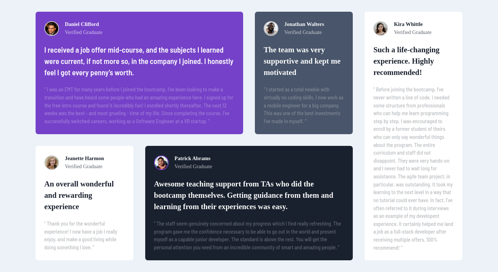

# Frontend Mentor - Testimonials grid section solution

This is a solution to the [Testimonials grid section challenge on Frontend Mentor](https://www.frontendmentor.io/challenges/testimonials-grid-section-Nnw6J7Un7). Frontend Mentor challenges help you improve your coding skills by building realistic projects.

## Table of contents

-   [Overview](#overview)
    -   [The challenge](#the-challenge)
    -   [Screenshot](#screenshot)
    -   [Links](#links)
-   [My process](#my-process)
    -   [Built with](#built-with)
    -   [What I learned](#what-i-learned)
    -   [Continued development](#continued-development)
    -   [Useful resources](#useful-resources)
-   [Author](#author)
-   [Acknowledgments](#acknowledgments)

## Overview

### The challenge

Users should be able to:

-   View the optimal layout for the site depending on their device's screen size
  

 *fig1: Preview of the challenge*

### Screenshot

  
*fig2: Mobile view*

  

*fig3: Desktop view*

### Links

-   Solution URL: [Add solution URL here](https://your-solution-url.com)
-   Live Site URL: [Add live site URL here](https://your-live-site-url.com)

## My process

### Built with

-   Semantic HTML5 markup
-   CSS custom properties
-   Flexbox
-   CSS Grid

### What I learned

I learnt how to dynamize the card to fit content instead of 1fr which was cool.

```CSS
.container{
    display: grid;
    grid-template-columns: repeat(12, minmax(min-content, 1fr));
    grid-template-rows: repeat(2, minmax(min-content, auto));
}
```

The difference between the above and
```grid-template-rows: repeat(12, 1fr);``` is that in ```grid-template-rows: repeat(12, 1fr);``` :

-   All rows will have the same height, distributing the available space equally among them.
-   Useful for grids where you want all rows to have the same height, especially when you have a large number of rows.

While with using ```grid-template-columns: repeat(12, minmax(min-content, 1fr));``` :

-   This sets up a grid with 12 columns, where each column's width is determined by its content (minimum content size) but can grow up to the height of the tallest item in the row (maximum content size).
-   Rows will adjust their height based on the content they contain, ensuring that content is not cut off or overflowed.
-   Useful when you have varying content heights and want rows to dynamically adjust their height accordingly.

### Continued development

I am committed to advancing my proficiency in CSS Grid, particularly in mastering **grid areas** and **optimizing grid-cards dynamically based on their content**, as demonstrated in my recent challenge. I aspire to refine my skills to a professional level, enabling me to create sophisticated and responsive web layouts with ease and precision. Through dedicated practice and exploration of advanced CSS Grid techniques, I aim to enhance my ability to design visually appealing and adaptable interfaces that meet modern web design standards.

### Useful resources

-   [Example resource 1](https://www.joshwcomeau.com/) - This helped me with custom CSS reset and goal the of a reset stylesheet is to reduce browser inconsistencies in things like default line heights, margins and font sizes of headings, and so on. .
-   [Example resource 2](https://www.coursera.org/learn/learn-css-grid/home/week/1) - This is a course --short that showcases in less time the functionalities of Grid

## Author

-   Website - Grace-Njenga(https://github.com/Grace-Njenga)
-   Frontend Mentor - Grace Njenga (https://www.frontendmentor.io/profile/Grace Njenga)

## Acknowledgments

I would give a hat tip to KEVIN POWELL mostyly as he has taught me all about css and im very thankful.
